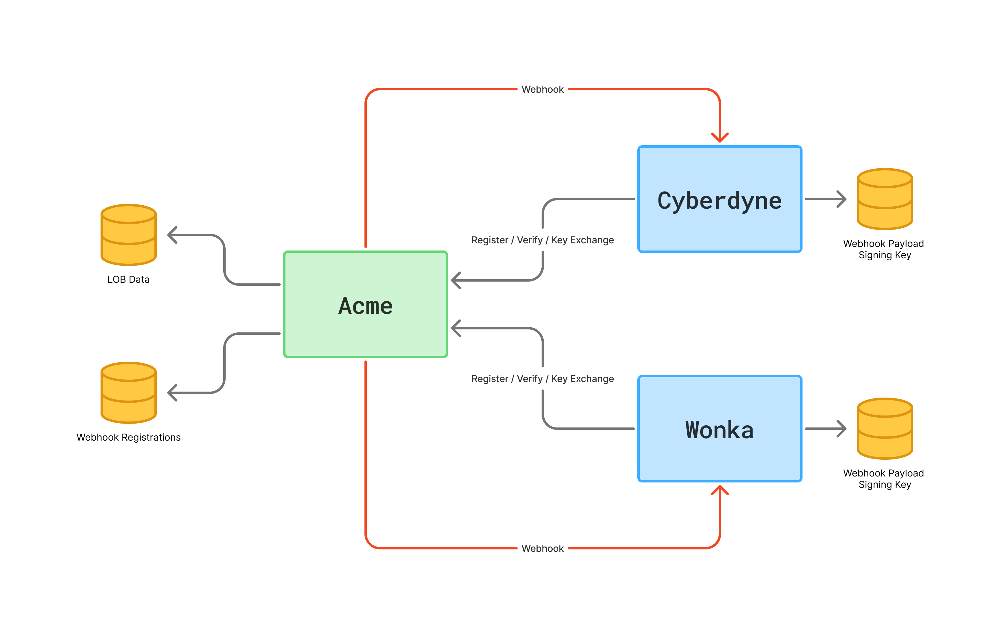

# NDC Copenhagen 2025 Workshop Sample

The sample consists of three applications, a webhook producer (**Acme**) and two webhook consumers (**Cyberdyne** and **Wonka**). To ensure message integrity, webhook payloads are signed using consumer-specific keys. On the flip-side, consumers verify the signature of payloads received to ensure data has not been modified in transit. 

Signing and Signature verification, are shared across all applications, no matter which language an application is written in. By leveraging the WebAssembly Component Model, we could implement signing and signature verification once (see [`signing`](./signing/)), and use it from any programming language without worrying about how programming languages layout data structures in memory or how to use Foreign Function Inferfaces (FFI). Allowing us to implement a particular piece of code once and use it everywhere.



## Webhook Registration Flow

Whenever a consumer registers to receive webhooks from Acme, the following steps are performed:

- Webhook Consumer sends `POST` request to `/registrations` passing desired webhook event type and the receiving URL
- ACME generates a signing key for the webhook consumer 
- ACME sends verification request (`POST`) to receiving URL including consumer specific key and a `handshake=true` query string parameter
- Webhook consumer must respond with HTTP `200` to one-time verification request
- ACME stores webhook consumer in its data store


## Webhook Firing Flow

ACME could fire webhooks based on different circumstances (e.g. data has been added or modified). For each action that should fire a webhook the following steps are performed:

- Webhook payload is created
- Webhook Registrations are loaded from data store
- Webhook consumer specific key is used to compute payload signature
- A `POST` request is sent to the receiving URL which contains the payload as request body and the signature as HTTP header

~[What happens when a webhook is fired](./assets/ndc-sample-webhook-firing.png)

## Prerequisites

To compile and run the sample application, you need the following on your machine:

- Rust `1.89.0` or newer
- Python `3.13.5` or newer 
- Spin CLI (`3.4.0` or newer)

## Compiling

See the [`Makefile`](./Makefile) which provides targets for compiling all different applications. For example. you can compile the Acme application using the following command:

```bash
# Compiling the Acme application
make build-acme
```


Use `build-cyberdyne` and `build-wonka` to compile Cyberdyne and Wonka. 

As an alternative you can use the `build-all` target:

```bash
# Compile all applications
make build-all
```

## Running locally

To run the application locally, run each of the following commands in a dedicated terminal instance:

```bash
# Run Acme in a dedicated Terminal instance
make run-acme

# Run Cyberdyne in a dedicated Terminal instance
make run-cyberdyne

# Run Wonka in a dedicated Terminal instance
make run-wonka 
```


